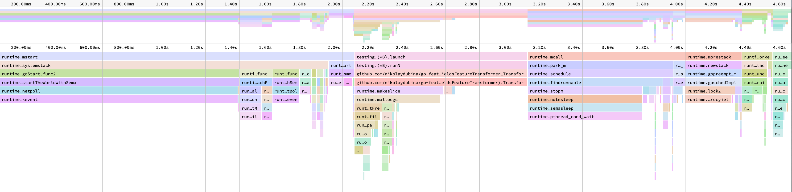
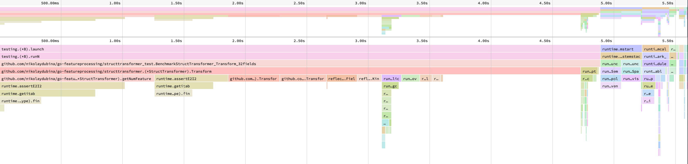

# go-featureprocessing

[](https://goreportcard.com/report/github.com/nikolaydubina/go-featureprocessing)
[](https://codecov.io/gh/nikolaydubina/go-featureprocessing)
[](https://pkg.go.dev/github.com/nikolaydubina/go-featureprocessing)
[](https://github.com/avelino/awesome-go)

> _Perfect for low latency machine learning inference of data models in Go_

Fast and easy feature processing in Go with feature parity of [sklearn](https://scikit-learn.org/stable/modules/preprocessing.html#non-linear-transformation).
Supports fitting and serialization. Does not cross `cgo` boundary. No memory allocation. Convenient to use and integrate with other languages and frameworks.

```go
//go:generate go run github.com/nikolaydubina/go-featureprocessing/cmd/generate -struct=Employee

type Employee struct {
	Age         int     `feature:"identity"`
	Salary      float64 `feature:"minmax"`
	Kids        int     `feature:"maxabs"`
	Weight      float64 `feature:"standard"`
	Height      float64 `feature:"quantile"`
	City        string  `feature:"onehot"`
	Car         string  `feature:"ordinal"`
	Income      float64 `feature:"kbins"`
	Description string  `feature:"tfidf"`
	SecretValue float64
}
``` 

Code above will generate a new struct as well _benchmarks_ and _tests_ using [google/gofuzz](https://github.com/google/gofuzz).
```go
employee := Employee{
   Age:         22,
   Salary:      1000.0,
   Kids:        2,
   Weight:      85.1,
   Height:      160.0,
   City:        "Pangyo",
   Car:         "Tesla",
   Income:      9000.1,
   SecretValue: 42,
   Description: "large text fields is not a problem neither, tf-idf can help here too! more advanced NLP will be added later!",
}

var fp EmployeeFeatureTransformer

config, _ := ioutil.ReadAll("employee_feature_processor.json")
json.Unmarshal(config, &fp)

fp.Transform(&employee)
// Output: []float64{22, 1, 0.5, 1.0039999999999998, 1, 1, 0, 0, 0, 1, 5, 0.7674945674619879, 0.4532946552278861, 0.4532946552278861}
```

You can also fit transformer based on data
```go
fp := EmployeeFeatureTransformer{}
fp.Fit([]Employee{...})

config, _ := json.Marshal(data)
_ = ioutil.WriteFile("employee_feature_processor.json", config, 0644)
```

This transformer can be serialized and de-serialized by standard Go routines.
Serialized transformer is easy to read, update, and integrate with other tools.
```json
{
   "Age": {},
   "Salary": {"Min": 500, "Max": 900},
   "Kids": {"Max": 4},
   "Weight": {"Mean": 60, "STD": 25},
   "Height": {"Quantiles": [20, 100, 110, 120, 150], "NQuantiles": 5},
   "City": {"Values": ["Pangyo", "Seoul", "Daejeon", "Busan"]},
   "Car": {"Mapping": {"BMW": 90000, "Tesla": 1}},
   "Income": {"Quantiles": [1000, 1100, 2000, 3000, 10000], "NQuantiles": 5},
   "Description": {
      "Mapping": {"help": 2, "problem": 1, "text": 0},
      "Separator": " ",
      "DocCount": {"0": 1, "1": 2, "2": 2},
      "NumDocuments": 2,
      "Normalizer": {}
   }
}
```

Or you can manually initialize it.
```go
fp := EmployeeFeatureTransformer{
   Salary: MinMaxScaler{Min: 500, Max: 900},
   Kids:   MaxAbsScaler{Max: 4},
   Weight: StandardScaler{Mean: 60, STD: 25},
   Height: QuantileScaler{Quantiles: []float64{20, 100, 110, 120, 150}, NQuantiles: 5},
   City:   OneHotEncoder{Values: []string{"Pangyo", "Seoul", "Daejeon", "Busan"}},
   Car:    OrdinalEncoder{Mapping: map[string]float64{"Tesla": 1, "BMW": 90000}},
   Income: KBinsDiscretizer{QuantileScaler: QuantileScaler{Quantiles: []float64{1000, 1100, 2000, 3000, 10000}, NQuantiles: 5}},
   Description: TFIDFVectorizer{
      NumDocuments:    2,
      DocCount:        map[int]int{0: 1, 1: 2, 2: 2},
      CountVectorizer: CountVectorizer{Mapping: map[string]int{"text": 0, "problem": 1, "help": 2}, Separator: " "},
   },
}
```

### Supported transformers

- [x] `numerical` MinMaxScaler
- [x] `numerical` MaxAbsScaler
- [x] `numerical` StandardScaler
- [x] `numerical` QuantileScaler
- [x] `numerical` SampleNormalizerL1
- [x] `numerical` SampleNormalizerL2
- [x] `categorical` OneHotEncoder
- [x] `categorical` OrdinalEncoder
- [x] `numerical` KBinsDiscretizer
- [x] `text` CountVectorizer
- [x] `text` TFIDFVectorizer

### Benchmarks

For typical use, with this struct encoder you can get <100ns processing time. How fast you need to get? Here are some numbers:

```
                       0 - C++ FlatBuffers decode
                     ...
                   200ps - 4.6GHz single cycle time
                1ns      - L1 cache latency
               10ns      - L2/L3 cache SRAM latency
               20ns      - DDR4 CAS, first byte from memory latency
               20ns      - C++ raw hardcoded structs access
               80ns      - C++ FlatBuffers decode/traverse/dealloc
 ---------->  100ns      - go-featureprocessing typical processing
              150ns      - PCIe bus latency
              171ns      - Go cgo call boundary, 2015
              200ns      - some High Frequency Trading FPGA claims
              800ns      - Go Protocol Buffers Marshal
              837ns      - Go json-iterator/go json decode
           1µs           - Go Protocol Buffers Unmarshal
           1µs           - High Frequency Trading FPGA
           3µs           - Go JSON Marshal
           7µs           - Go JSON Unmarshal
           9µs           - Go XML Marshal
          10µs           - PCIe/NVLink startup time
          17µs           - Python JSON encode or decode times
          30µs           - UNIX domain socket, eventfd, fifo pipes latency
          30µs           - Go XML Unmarshal
         100µs           - Redis intrinsic latency
         100µs           - AWS DynamoDB + DAX
         100µs           - KDB+ queries
         100µs           - High Frequency Trading direct market access range
         200µs           - 1GB/s network air latency
         200µs           - Go garbage collector latency 2018
         500µs           - NGINX/Kong added latency
     10ms                - AWS DynamoDB
     10ms                - WIFI6 "air" latency
     15ms                - AWS Sagemaker latency
     30ms                - 5G "air" latency
    100ms                - typical roundtrip from mobile to backend
    200ms                - AWS RDS MySQL/PostgreSQL or AWS Aurora
 10s                     - AWS Cloudfront 1MB transfer time
```

```
goos: darwin
goarch: amd64
pkg: github.com/nikolaydubina/go-featureprocessing/cmd/generate/tests
BenchmarkAllTransformersFeatureTransformer_Transform-4                                         	22896980	       155 ns/op	      80 B/op	       1 allocs/op
BenchmarkAllTransformersFeatureTransformer_Transform_LargeComposites_100elements-4             	 3778204	       940 ns/op	    2688 B/op	       1 allocs/op
BenchmarkAllTransformersFeatureTransformer_Transform_LargeComposites_1000elements-4            	  485426	      7215 ns/op	   24576 B/op	       1 allocs/op
BenchmarkAllTransformersFeatureTransformer_Transform_LargeComposites_10000elements-4           	   57453	     62333 ns/op	  237568 B/op	       1 allocs/op
BenchmarkAllTransformersFeatureTransformer_Transform_LargeComposites_100000elements-4          	    3054	   1086724 ns/op	 2277376 B/op	       1 allocs/op
BenchmarkEmployeeFeatureTransformer_Transform-4                                                	30949274	       114 ns/op	      80 B/op	       1 allocs/op
BenchmarkEmployeeFeatureTransformer_Transform_LargeComposites_100elements-4                    	 4824252	       753 ns/op	    1792 B/op	       1 allocs/op
BenchmarkEmployeeFeatureTransformer_Transform_LargeComposites_1000elements-4                   	  521397	      6286 ns/op	   16384 B/op	       1 allocs/op
BenchmarkEmployeeFeatureTransformer_Transform_LargeComposites_10000elements-4                  	   66386	     53885 ns/op	  155648 B/op	       1 allocs/op
BenchmarkEmployeeFeatureTransformer_Transform_LargeComposites_100000elements-4                 	    7140	    520269 ns/op	 1540096 B/op	       1 allocs/op
BenchmarkLargeMemoryTransformerFeatureTransformer_Transform-4                                  	37419522	      92.9 ns/op	      64 B/op	       1 allocs/op
BenchmarkLargeMemoryTransformerFeatureTransformer_Transform_LargeComposites_100elements-4      	 6168792	       581 ns/op	    1792 B/op	       1 allocs/op
BenchmarkLargeMemoryTransformerFeatureTransformer_Transform_LargeComposites_1000elements-4     	  767218	      4528 ns/op	   16384 B/op	       1 allocs/op
BenchmarkLargeMemoryTransformerFeatureTransformer_Transform_LargeComposites_10000elements-4    	   95557	     38307 ns/op	  163840 B/op	       1 allocs/op
BenchmarkLargeMemoryTransformerFeatureTransformer_Transform_LargeComposites_100000elements-4   	    8799	    410428 ns/op	 1605632 B/op	       1 allocs/op
```

### [beta] Reflection based version

If you can't use `go:gencode` version, you can try relfection based version.
Note, that reflection version intrudes overhead that is particularly noticeable if your struct has a lot of fields.
You would get ~2x time increase for struct with large composite transformers. 
And you would get ~20x time increase for struct with 32 fields.
Note, some features like serialization and de-serialization are not supported yet.

Benchmarks:
```
goos: darwin
goarch: amd64
pkg: github.com/nikolaydubina/go-featureprocessing/structtransformer
BenchmarkStructTransformerTransformSmall-4                               9994407               360 ns/op             120 B/op          4 allocs/op
BenchmarkStructTransformerTransform_LargeComposites_100elements-4        1656445              2198 ns/op            3696 B/op          6 allocs/op
BenchmarkStructTransformerTransform_LargeComposites_1000elements-4        244172             14227 ns/op           32880 B/op          6 allocs/op
BenchmarkStructTransformerTransform_LargeComposites_10000elements-4        25909            136303 ns/op          327792 B/op          6 allocs/op
BenchmarkStructTransformerTransform_LargeComposites_100000elements-4        1735           1871483 ns/op         3211376 B/op          6 allocs/op
BenchmarkStructTransformerTransform_32fields-4                           1732573              2079 ns/op             512 B/op          2 allocs/op
```

### Profiling

From profiling benchmarks for struct with 32 fields, we see that reflect version takes much longer and spends time on what looks like reflection related code.
Meanwhile `go:generate` version is fast enough to compar to testing routines themselves and spends 50% of the time on allocating single output slice, which is good since means memory access is a bottleneck.
Run `make profile` to make profiles.
Flamegraphs were produced from pprof output by https://www.speedscope.app/.

gencode:



reflect:


### Comments, Corrections, Feature Requests, Improvements

Feel free to open an issue or submit a PR! Some outstanding tasks:

- [ ] order fields in order different from struct declaration
- [ ] same field multiple transformers
- [ ] sklearn model to serialized transformer json conversion tool
- [ ] batch transformations
- [ ] hand crafted assembly

### Reference

- https://dave.cheney.net/2016/01/18/cgo-is-not-go
- https://github.com/json-iterator/go
- https://benchmarksgame-team.pages.debian.net/benchmarksgame/fastest/go.html
- https://github.com/shmuelamar/python-serialization-benchmarks
- https://shijuvar.medium.com/benchmarking-protocol-buffers-json-and-xml-in-go-57fa89b8525
- https://gist.github.com/shijuvar/25ad7de9505232c87034b8359543404a#file-order_test-go
- https://google.github.io/flatbuffers/flatbuffers_benchmarks.html
- https://www.cockroachlabs.com/blog/the-cost-and-complexity-of-cgo/
- https://en.wikipedia.org/wiki/CAS_latency
